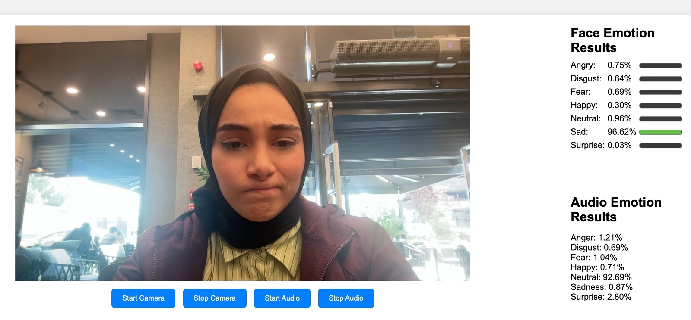
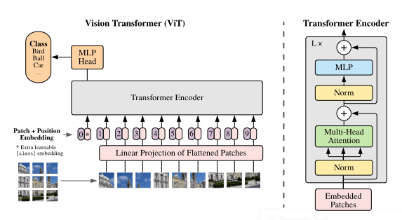
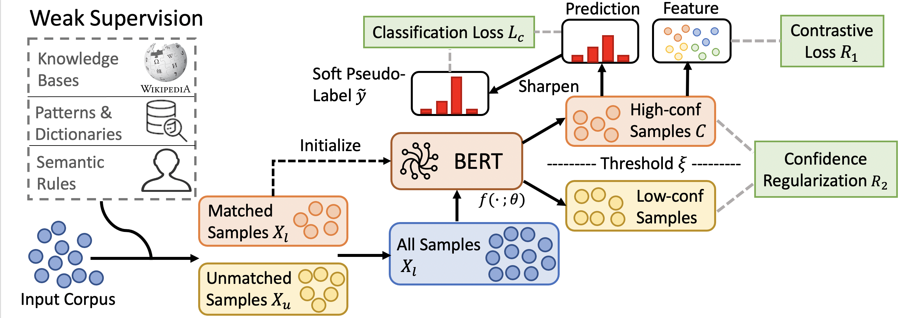

# Real-Time Emotion Detection (Face - Voice)

By student : Elif Nur Aslıhan Celepoğlu

Id:1904010023


This project aims to develop a system for analyzing real-time facial expressions and voices. The system detects emotions as a result of analyzing facial expressions and sounds. 
This project was developed as a web project and allows users to detect their emotions by analyzing their facial expressions and voices.

## Introduction

- used dataset fer-2023 and RoBERTa
- fer-2023 used Vision Transformer (ViT)
- RoBERTa used Masked language modeling (MLM) 

**seven emotions** - angry, disguste, fear, happy, neutral, sad and surprised.

## Result output 


## Installation Instructions

### First, clone the repository and enter the folder

For Windows;
```bash
git clone https://github.com/elif1906/realtime-emotion-detection.git
cd realtime-emotion-detection
```
 For Mac;
 ```bash
git clone git@github.com:elif1906/realtime-emotion-detection.git
cd realtime-emotion-detection
```
### Second, requirements.txt


```bash
pip install -r  requirements.txt
```

### Third, run app.py file
```bash
python app.py
```

## About the Models
## About the Models

### Face Model: ViT (Vision Transformer) Facial Expression Recognition Model

#### Data Processing
The input images are preprocessed before being fed into the model. The preprocessing steps include:

- **Resizing**: Images are resized to the specified input size.
- **Normalization**: Pixel values are normalized to a specific range.
- **Data Augmentation**: Random transformations such as rotations, flips, and zooms are applied to augment the training dataset.

#### Modeling
The model is based on the Vision Transformer (ViT) architecture, which has gained popularity in image processing. Originally successful in language models, the Transformer architecture has been adapted for image processing tasks.

##### Model Features
- ViT utilizes Transformer blocks instead of convolutional neural networks (CNNs) for image processing tasks.
- The model is trained for facial expression recognition tasks using a dataset of facial photographs representing different emotional expressions.
- It is capable of recognizing and classifying emotional expressions.



#### Training Data
- **Evaluation Metrics**:
  - Validation set accuracy: 0.7113
  - Test set accuracy: 0.7116

### Voice Model: RoBERTa for Sentiment Analysis

#### Data Processing
During training, the objective is to create start and end logits for each context of a particular question. The steps include:

1. Determining the end index using the length of the answer.
2. Creating a mask (list) the size of the context, marking positions containing the answer with 1 and others with 0.
3. Generating offsets for each token in the context and appending tokens whose offset spans contain ones to a list. This list contains tuples holding positions of tokens present in the answer, making the start token the first tuple and the end token the last tuple.

#### Modeling
Masked Language Modeling (MLM) is used to train the language model. By masking some words or tokens within the text, the model learns to predict these hidden words, improving its understanding of language context for more accurate predictions. The method used here performs sentiment analysis from text, incorporating audio by converting it into text and then analyzing the sentiment.



#### Training
- **Learning Rate**: 3e-5 (as specified in the paper)
- **Loss**: Categorical cross-entropy
- **Batch Size**: 4 (due to computational limitations; for optimal results, a batch size of 32 or 64 is recommended as specified in the BERT paper)
- **Epochs**: 3/4 (as specified in the paper)


