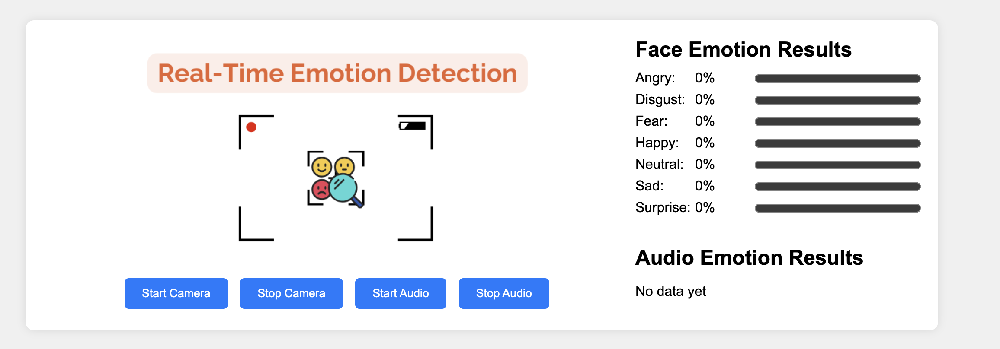

# Real-Time Emotion Detection (Face - Voice)
This project aims to develop a system for analyzing real-time facial expressions and voices. The system detects emotions as a result of analyzing facial expressions and sounds. 
This project was developed as a web project and allows users to detect their emotions by analyzing their facial expressions and voices.
## Introduction
used dataset for-2023 and ravdess
**seven emotions** - angry, disguste, fear, happy, neutral, sad and surprised.

* First, clone the repository and enter the folder

For Windows;
```bash
git clone https://github.com/elif1906/realtime-emotion-detection.git
cd realtime-emotion-detection
```
 For Mac;
 ```bash
git clone git@github.com:elif1906/realtime-emotion-detection.git
cd realtime-emotion-detection
```
* Second, activating the virtual environment

For Windows;
```bash
ai_project\Scripts\activate

```
For Mac;

```bash
source ai_project/bin/activate

```
* Third, run app.py file
```bash
python app.py
```
